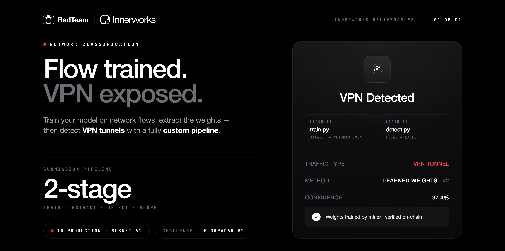

# FlowRadar: VPN Detection



This is a RedTeam Subnet FlowRadar VPN detection challenge repository.

Documentation page: <https://docs.theredteam.io/latest/challenges>

## ✨ Features

- RedTeam Subnet challenge
- Challenge module (Python package)
- Challenge controller and manager
- Challenge API (FastAPI)
- FlowRadar v2 submission flow:
    - `miner_output.commit_files` contains `train.py` and `submissions.py`
    - `train.py` receives the mandatory `v2_train_data.csv`
    - `submissions.py` receives each `v2_test_data.csv` row plus the trained model

---

## FlowRadar v2 Challenge Flow

Miners submit two Python files:

1. `train.py`
    - Called as `python train.py <training_csv> <model_json>`.
    - Receives `v2_train_data.csv`; miners cannot select or replace this dataset.
    - Must write a valid JSON model file.
2. `submissions.py`
    - Exposes `detect_vpn(features, model) -> bool`.
    - Runs inside the FlowRadar detector container.
    - Receives one row from `v2_test_data.csv` at a time and the JSON model produced by training.

The challenge API reads both files from `miner_output.commit_files` and mounts
them with `v2_train_data.csv` into the
isolated FlowRadar container. The container trains the model, keeps the model
temporary for that scoring run, and serves inference while the challenge
replays `v2_test_data.csv`.

Miners may not embed pretrained or externally generated model weights in either
file. All learned weights must be produced by `train.py` from
`v2_train_data.csv` during the current scoring run, and `submissions.py` may
only consume them through its `model` argument.

```json
{
  "miner_output": {
    "commit_files": [
      {"file_name": "train.py", "content": "..."},
      {"file_name": "submissions.py", "content": "..."}
    ]
  }
}
```

## 🐤 Getting Started

### 1. 🚧 Prerequisites

- Install [**docker** and **docker compose**](https://docs.docker.com/engine/install)
    - Docker image: [**redteamsubnet61/flowradar-challenge**](https://hub.docker.com/r/redteamsubnet61/flowradar-challenge)

[OPTIONAL] For **DEVELOPMENT** environment:

- Install **Python (>= v3.10)** and **pip (>= 23)**:
    - **[RECOMMENDED] [Miniconda (v3)](https://www.anaconda.com/docs/getting-started/miniconda/install)**
    - _[arm64/aarch64] [Miniforge (v3)](https://github.com/conda-forge/miniforge)_
    - _[Python virtual environment] [venv](https://docs.python.org/3/library/venv.html)_
- Install [**git**](https://git-scm.com/downloads)
- Install [**Git LFS**](https://git-lfs.com/) for `v2_train_data.csv`
- Setup an [**SSH key**](https://docs.github.com/en/github/authenticating-to-github/connecting-to-github-with-ssh)

### 2. 📥 Download or clone the repository

**2.1.** Prepare projects directory (if not exists):

```sh
# Create projects directory:
mkdir -pv ~/workspaces/projects

# Enter into projects directory:
cd ~/workspaces/projects
```

**2.2.** Follow one of the below options **[A]**, **[B]** or **[C]**:

**OPTION A.** Clone the repository:

```sh
git clone https://github.com/RedTeamSubnet/flowradar_v1.git && \
    cd flowradar_v1 && \
    git lfs pull
```

**OPTION B.** Clone the repository (for **DEVELOPMENT**: git + ssh key):

```sh
git clone git@github.com:RedTeamSubnet/flowradar_v1.git && \
    cd flowradar_v1 && \
    git lfs pull
```

**OPTION C.** Download source code:

1. Download archived **zip** or **tar.gz** file from [**releases**](https://github.com/RedTeamSubnet/flowradar_v1/releases).
2. Extract it into the projects directory.
3. Enter into the project directory.

#### [OPTIONAL] Install dependencies (for **DEVELOPMENT** environment)

```sh
# For DEVELOPMENT environment, install dependencies with pip:
pip install -e .[dev]
# Install pre-commit hooks:
pre-commit install
```

### 3. 🌎 Configure environment variables

[NOTE] Please, check **[environment variables](#-environment-variables)** section for more details.

```sh
# Copy '.env.example' file to '.env' file:
cp -v ./.env.example ./.env
# Edit environment variables to fit in your environment:
nano ./.env
```

### 4. 🏁 Start the server

```sh
## OPTIONAL: Configure 'compose.override.yml' file.
# For DEVELOPMENT environment:
cp -v ./templates/compose/compose.override.dev.yml ./compose.override.yml
# Edit 'compose.override.yml' file to fit in your environment:
nano ./compose.override.yml

## 1. Check docker compose configuration is valid:
./compose.sh validate
# Or:
docker compose config

## 2. Start docker compose:
./compose.sh start -l
# Or:
docker compose up -d --remove-orphans --force-recreate && \
    docker compose logs -f -n 100
```

### 5. ✅ Check server is running

Check with CLI (curl):

```sh
# Send a ping request with 'curl' to REST API server and parse JSON response with 'jq':
curl -s http://localhost:10001/ping | jq
```

Check with web browser:

- Health check: <http://localhost:10001/health>
- Swagger: <http://localhost:10001/docs>
- Redoc: <http://localhost:10001/redoc>
- OpenAPI JSON: <http://localhost:10001/openapi.json>

### 6. 🛑 Stop the server

Docker runtime:

```sh
# Stop docker compose:
./compose.sh stop
# Or:
docker compose down --remove-orphans
```

👍

---

## ⚙️ Configuration

### 🌎 Environment Variables

[**`.env.example`**](./.env.example):

```sh
## --- Environment variable --- ##
ENV=LOCAL
DEBUG=false
# TZ=UTC
# PYTHONDONTWRITEBYTECODE=1


## -- API configs -- ##
FLR_API_PORT=10001
# FLR_API_CONFIGS_DIR="/etc/flowradar-challenge"
# FLR_API_LOGS_DIR="/var/log/flowradar-challenge"
# FLR_API_DATA_DIR="/var/lib/flowradar-challenge"
# FLR_CHALLENGE_TRAIN_CSV_PATH="{data_dir}/v2_train_data.csv"
# FLR_CHALLENGE_TEST_CSV_PATH="{data_dir}/v2_test_data.csv"
# FLR_CHALLENGE_TRAINING_TIMEOUT_SECONDS=600
# FLR_API_TMP_DIR="/tmp/flowradar-challenge"
# FLR_API_VERSION="1"
# FLR_API_PREFIX=""
# FLR_API_DOCS_ENABLED=true
# FLR_API_DOCS_OPENAPI_URL="{api_prefix}/openapi.json"
# FLR_API_DOCS_DOCS_URL="{api_prefix}/docs"
# FLR_API_DOCS_REDOC_URL="{api_prefix}/redoc"
```

---

## 🏗️ Build Docker Image

Before building the docker image, make sure you have installed **docker** and **docker compose**.

To build the docker image, run the following command:

```sh
# Build docker image:
./scripts/build.sh
# Or:
docker compose build
```

## 📚 Documentation

- <https://docs.theredteam.io/latest/challenges>
- [Docs index](./docs/README.md)
- [Testing manual](./docs/testing-manual.md)
- [Miner v2 submission guide](./docs/miner-v2-submission.md)

---

## 📑 References

- RedTeam Subnet: <https://www.theredteam.io>
- Bittensor: <https://www.bittensor.com>
- FastAPI - <https://fastapi.tiangolo.com>
- Docker - <https://docs.docker.com>
- Docker Compose - <https://docs.docker.com/compose>
